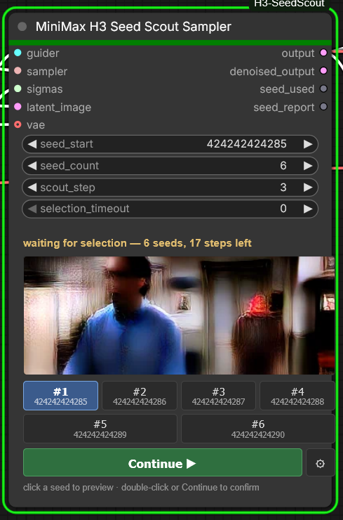

# ComfyUI-H3-SeedScout

**MiniMax H3 Seed Scout Sampler** — audition many seeds cheaply, pick the best one, finish only that one.

Scouts N seeds through just the first few steps of the full sigma schedule (a true "step 3 of 20", not a separate 3-step run), shows an animated preview per seed on the node, pauses until you click the seed you want, then continues that exact seed's latent through the remaining steps. One queued prompt, one full-quality result.

<p align="center"></p>

## Install

```
cd ComfyUI/custom_nodes
git clone https://github.com/tsuremen2/ComfyUI-H3-SeedScout
```

Restart ComfyUI and hard-refresh the browser.

## Wiring

The node replaces `RandomNoise` + `SamplerCustomAdvanced`:

| Input | From |
|---|---|
| `guider` | BasicGuider |
| `sampler` | KSamplerSelect |
| `sigmas` | BasicScheduler (full schedule, e.g. 20 steps) |
| `latent_image` | MiniMax H3 latent (e.g. MiniMaxH3ImageToVideo) |
| `vae` | H3 **video** VAE (optional, for previews) |

`output` (LATENT) → VAEDecode / VAEDecodeAudio as usual.

## Use

Queue the prompt. Seed previews appear on the node as they finish; when all are done, click a seed to preview it, double-click (or **Continue ▶**) to confirm. The remaining steps run on that seed and the workflow completes normally.

Visible widgets: `seed_start`, `seed_count`, `scout_step` (pause step), `selection_timeout` (0 = wait forever). Everything else — mode (`interactive` / `scout` / `final`), preview settings, filename prefix — is under the **⚙** button.

Scouted seeds use the same noise as `RandomNoise`, so any seed also reproduces in a stock workflow.

## Previews

- `vae` (default): decodes previews with the real H3 video VAE. Efficient frame counts are 5, 22, 39, … 124; `preview_frames=124` at `preview_fps=24` previews full clips in real time.
- `tae`: fast tiny-VAE previews via [Kijai's taeh3](https://huggingface.co/Kijai/MiniMax-H3-TAE) — place `taeh3.safetensors` in `models/vae_approx/` (option appears after restart; uses ComfyUI-KJNodes' decoder, so KJNodes must be installed). Also used automatically for the live previews while scouting.
- `latent2rgb`: free fallback, no extra files.

## Modes

- `interactive` (default): the flow above. Needs a browser connected; headless runs fall back to the first seed.
- `scout`: previews only — saves one labelled WebP per seed to the output folder, no pausing. For API/headless seed hunting.
- `final`: behaves exactly like `SamplerCustomAdvanced` with `selected_seed`.
